# SpriteForge

**A LoRA for swapping characters into fighting game sprite sheets**

Built for the [Qwen-Image LoRA Training Competition](https://modelscope.ai/active/qwenimagelora) on ModelScope.

Base model: Qwen-Image-Edit-2511

---

## The Problem

Consistent multi-frame sprite sheets are hard. AI image models struggle to maintain character consistency across 16 frames in a single 4x4 grid — poses become incoherent, characters change appearance between cells.

<div style="display: grid; grid-template-columns: 1fr 1fr; gap: 8px; max-width: 800px;">
  
  
  
  
</div>

*Base Qwen-Image-Edit without LoRA: inconsistent character appearance and incoherent frame sequences*

Manual pixel art gives consistency but takes hours of skilled artist work per sheet. A typical fighting game needs 10+ characters × 10+ animations = 100+ sprite sheets.

---

## The Approach: Template-Based Character Swapping

Instead of asking the model to generate sprite sheets from scratch, we reframe the task as **character replacement** — something image editing models are built for.

The model receives:
1. **A character reference image** — who you want
2. **An existing sprite sheet template** — what animation/poses to use
3. **A simple prompt** — "Replace the character in the sprite sheet with the character from the reference image"

The consistency comes from the template, not the generation. The LoRA refines the base model's character swapping for the specific domain of 4×4 sprite grids — improving frame-to-frame consistency.

**Input:**

<div style="display: grid; grid-template-columns: 1fr 1fr; gap: 8px; max-width: 600px; align-items: center;">
  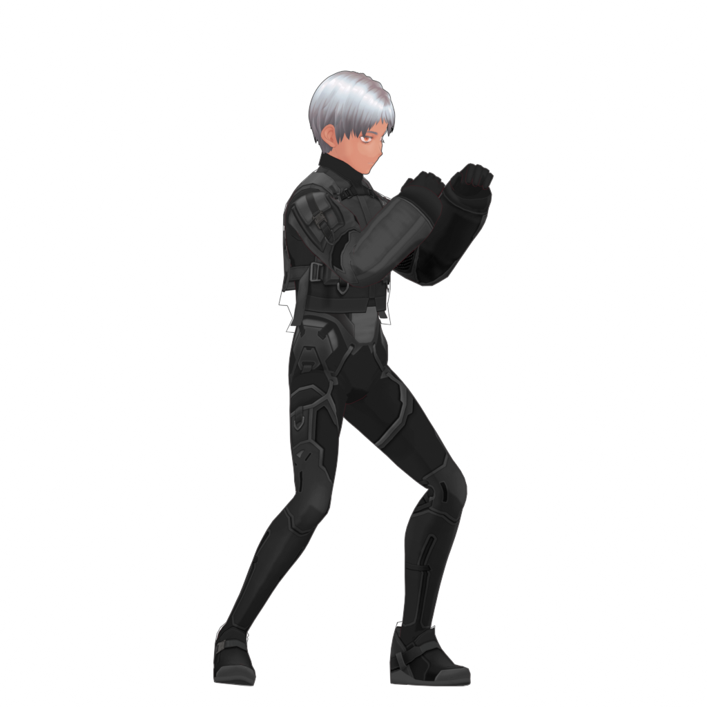
  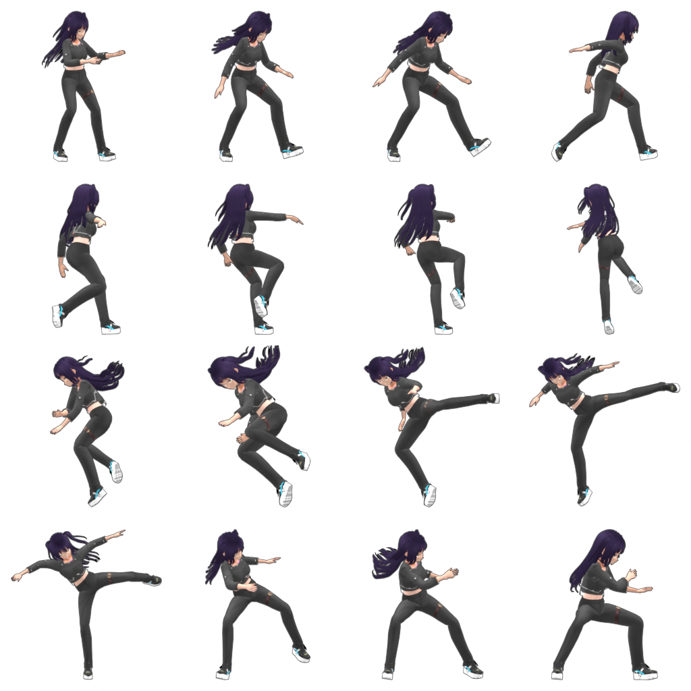
</div>

*Left: Character A reference (army_man) — Right: Template sprite sheet (original character)*

<div style="text-align: center; font-size: 2em; margin: 8px 0;">&#x2B07;</div>

**Output:**

<div style="display: grid; grid-template-columns: 1fr 1fr; gap: 8px; max-width: 600px; align-items: center;">
  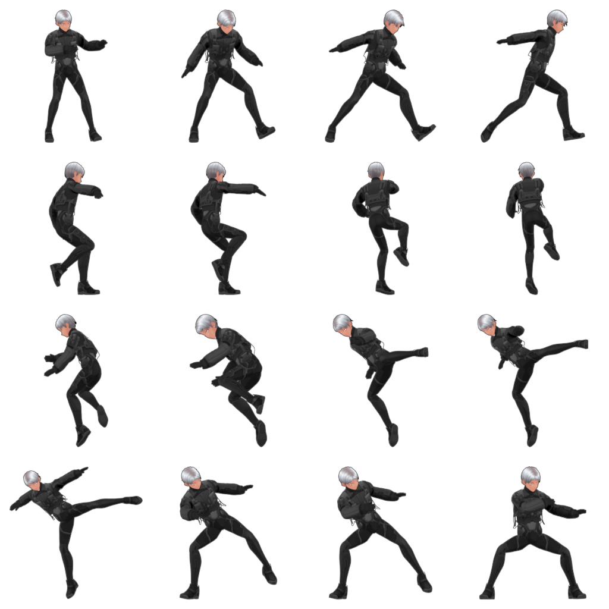
  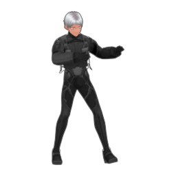
</div>

*Character A in the same poses as the template — consistent across all 16 frames*


---

## Where Do Templates Come From?

Templates can come from any source — the LoRA doesn't care how the template was made, it just swaps the character. Possible sources include:

- **3D rendering pipelines** (Blender + Mixamo — our approach)
- **Hand-drawn sprite sheets** (draw one character's sheet, reuse as template for others)
- **Existing game assets** (use sprites from your own or open-source games)
- **AI-generated + manually corrected** (generate one good sheet, fix any bad frames, use as template forever)

We demonstrate template generation using a Blender + Mixamo pipeline as a proof of concept:

### Training Data: 7 Characters × 14 Animations

<div style="display: grid; grid-template-columns: 1fr 1fr 1fr 1fr; gap: 8px; max-width: 600px;">
  
  
  
  
</div>

*4 of the 7 training characters (VRoid Studio → Mixamo → Blender)*

14 fighting animations: Idle, Walk, Run+Roll, Left/Right Hook, Hook+Right Hook, Quad Punch, Knee+Roundhouse Kick, Spinning Kick, Fall+Get Up, Armada, Hit+Block, Left/Right Kick, Knees to Uppercut, Punch Elbow Combo, and a 360° Northern Soul Spin.

<div style="display: grid; grid-template-columns: 1fr 1fr; gap: 8px; max-width: 600px;">
  
  
  
  
</div>

### 360° Spin Sheet

The Northern Soul Spin captures the character from all angles — each frame shows a different rotation.

<div style="display: grid; grid-template-columns: 1fr 1fr; gap: 8px; max-width: 500px;">
  
  
</div>

---

## Results

### 1. Seen Animations, Unseen Characters

Characters the model never saw during training, applied to training animations. All characters below are unseen — only the animation templates are from training data.

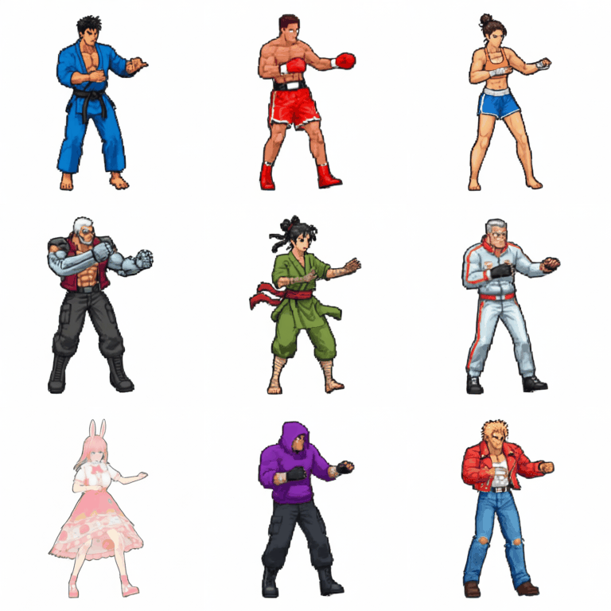

*9 different unseen characters on the same training animation — consistent poses, different identities*

### 2. Unseen Animations, Unseen Characters

Both the characters AND the animations are unseen — the model generalizes to completely new inputs.

<div style="display: grid; grid-template-columns: 1fr 1fr 1fr; gap: 8px; max-width: 800px;">
  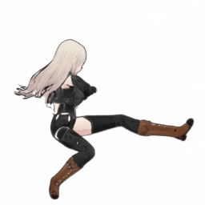
  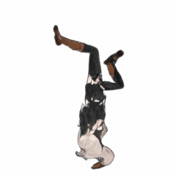
  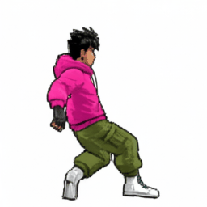
</div>

*Unseen characters on unseen animations — the model maintains character consistency even on animation templates it was never trained on*

### 3. Full Character Showcase — Boxer Girl on All Training Animations

One character across all seen animations, demonstrating consistent identity across diverse fighting moves:

<div style="display: grid; grid-template-columns: 1fr 1fr 1fr 1fr; gap: 8px; max-width: 800px;">
  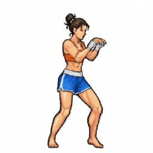
  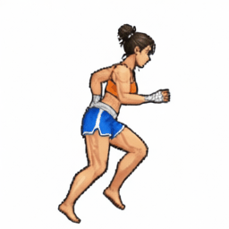
  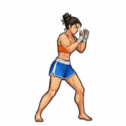
  
  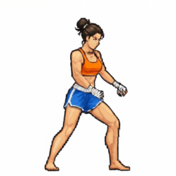
  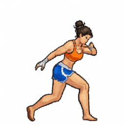
  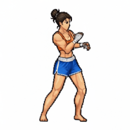
  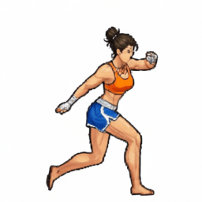
  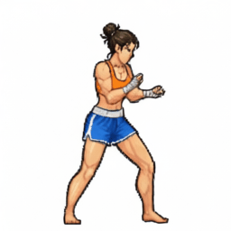
  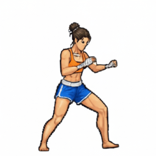
</div>

*Same character, 10 different fighting animations — consistent appearance across all poses*

### 4. Boxer Girl on Unseen Animations

The same character on animations the model never saw during training:

<div style="display: grid; grid-template-columns: 1fr 1fr 1fr; gap: 8px; max-width: 800px;">
  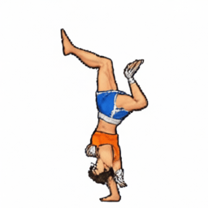
  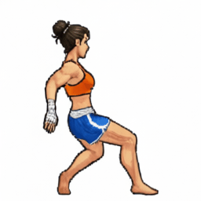
  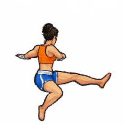
  
  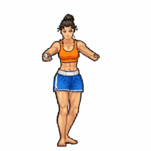
</div>

*Same character on 5 unseen animations — the model preserves character identity even on completely new animation templates*

---

## What Worked and What Didn't

### Iteration 1: Generate from Scratch ❌

Single input (character reference) → model generates sprite sheet. The model learned to produce 4x4 grids but couldn't maintain coherent frame-to-frame animation. An image **editing** model shouldn't be asked to **generate** complex structured outputs from scratch.

### Iteration 2: Detailed Per-Frame Prompts ❌

Same approach but with 600+ character prompts describing each of the 16 frames individually. No improvement — LoRA doesn't have enough capacity for conditional per-frame spatial generation from text.

### Iteration 3: Character Swap ✅

Multi-image input: character reference + existing sprite sheet template → swap the character. This works because it leverages the model's core strength (image editing) and provides the layout as input rather than asking the model to learn it.

---

## Model Architecture & Technical Details

### Architecture

LoRA fine-tuned on **Qwen-Image-Edit-2511** using ModelScope Civision. Multi-image input format: the model receives a character reference image and an existing sprite sheet template, then outputs a new sprite sheet with the reference character swapped in while preserving all poses and frame layout. 100 training pairs with random template character mixing to prevent overfitting to specific character pairings.

The base Qwen-Image-Edit model already handles character replacement well, but produces occasional inconsistencies in multi-frame layouts. The LoRA refines this for the specific domain of 4×4 sprite grids.

### Template Generation Pipeline

We demonstrate one approach to template creation using a 3D rendering pipeline:

```
VRoid Studio → VRM characters
    → Mixamo auto-rig + 25 animations
        → Blender retarget + GPU render
            → 1024×1024 sprite sheets + character references
                → Training pairs with random template mixing
```

This is a proof of concept — templates can come from any source that produces consistent multi-frame sprite sheets.

### Training Details

- **Base model:** Qwen-Image-Edit-2511
- **Training pairs:** 100 (multi-image: reference + template → output)
- **Prompt:** "Replace the character in the sprite sheet with the character from the reference image"
- **Epochs:** 10
- **Repeat:** 5
- **Checkpoint used:** 10
- **Trigger word:** None
- **All other parameters:** Default (ModelScope Civision)
- **Platform:** ModelScope Civision
- **Note:** Inference requires ~40GB VRAM. Free inference is available on ModelScope.

### Training Parameters


### Training Loss


Loss is still decreasing at epoch 10 with no sign of plateau — the model could benefit from additional training epochs.

---

## Application

**For creators who have 2D character designs but need game-ready sprite sheets — without creating 3D models.**

1. Pick a sprite sheet template from the curated library (or use your own)
2. Provide your character reference image (any style — sketch, pixel art, concept art, photo)
3. Get a consistent 16-frame sprite sheet in seconds

The approach avoids the multi-frame consistency problem entirely by separating **animation structure** (from the template) from **character identity** (from the reference image).

---

## Limitations

We believe in being transparent about what the model can and cannot do:

- **Unseen animations with unusual poses may produce artifacts.** The model works reliably on animations similar to the training data (fighting moves, dance, standard locomotion). However, animations with extreme poses — such as ground rolls, inverted positions, or poses that differ significantly from the character reference — can result in unnatural character positioning. The model relies on the reference image to understand the character's appearance; poses that show body parts from angles not visible in the reference require hallucination.

**Example: Macaco Side (unseen animation with extreme poses)**

The Macaco Side is a capoeira acrobatic move involving handstands and flips — poses far outside the training data. Here's the original 3D-rendered template:

<div style="display: grid; grid-template-columns: 1fr 1fr; gap: 8px; max-width: 600px;">
  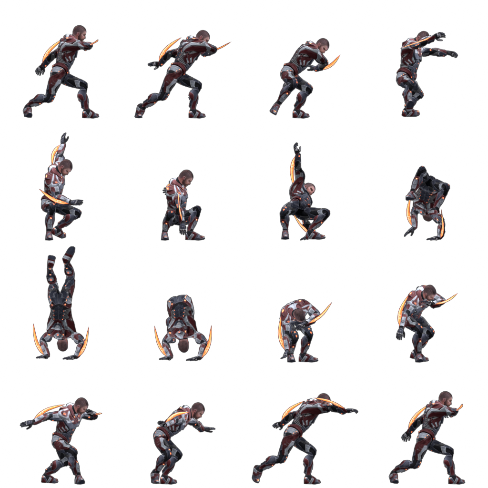
  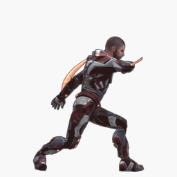
</div>

*Original template: 3D-rendered Macaco Side animation*

And here's what the model produces when swapping in a new character:

<div style="display: grid; grid-template-columns: 1fr 1fr; gap: 8px; max-width: 600px;">
  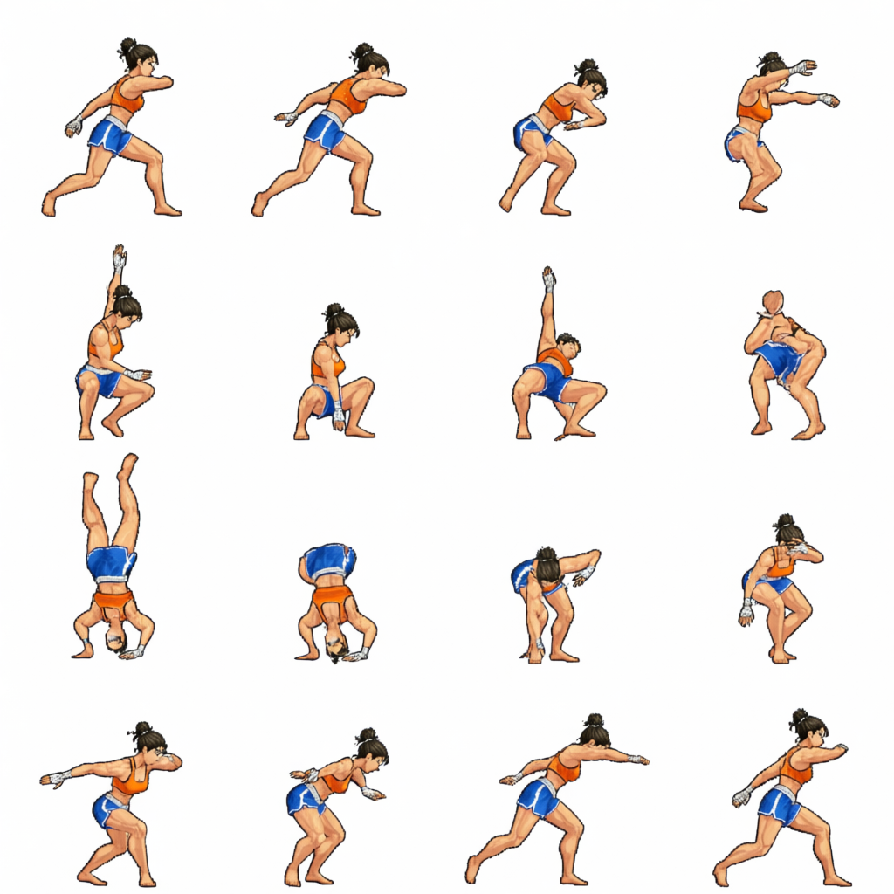
  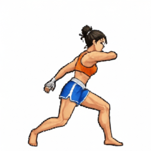
</div>

*Generated output: the inverted frames (handstands, flips) show distorted body proportions and unnatural limb positioning. The model struggles to reconstruct the character from angles it has never seen in the reference image.*

- **Single reference image limitation.** The model receives only one character reference (an idle fighting stance). It must infer the character's appearance from all other angles based on this single view. Characters with asymmetric designs (e.g., different patterns on left vs right side) may not be fully captured.

- **Template dependent.** Output quality depends on template quality. If the template sprite sheet has artifacts or inconsistencies, the output inherits them.

- **Compute requirements.** Qwen-Image-Edit-2511 requires ~40GB VRAM for local inference. Free inference is available on ModelScope, but self-hosting at scale requires significant GPU resources.

---

## Impact

### The Cost of Fighting Game Sprites

Professional 2D fighting game sprite animation is one of the most time-intensive tasks in game development.

For sprites at our scale (~200-256px), [2D Will Never Die](https://2dwillneverdie.com/blog/how-much-do-sprites-cost/) reports:

- **Key animation frames** take up to **2 hours each** to draw
- A professional artist produces roughly **4 frames per day**
- A single character with a full moveset (500+ frames) costs **$20,000–$30,000** — and fine-tuning for gameplay balance can **double that cost**

At the high end, HD fighting games require even more:

- **King of Fighters XII** (HD sprites): Each character took **16-17 months** with 500+ frames. Only 10 artists on the team, limiting the roster to 20 characters — the lowest in series history. ([SNK DOT Creation](https://kofaniv.snk-corp.co.jp/english/info/15th_anniv/2d_dot/creation/index.php))
- **Skullgirls** (HD hand-drawn): Guinness World Record for most frames — **1,439 frames per character**, all drawn in Photoshop. ([Skullgirls Wiki](https://skullgirls.fandom.com/wiki/Digital_Art_Compendium))

### Rapid Prototyping

SpriteForge doesn't replace professional pixel artists — the output quality isn't production-ready for a AAA release. But it dramatically accelerates the **design exploration phase**:

- A game designer can sketch a character, run it through SpriteForge, and see how it looks across every fighting animation in **minutes instead of weeks**
- Test 20 character designs in a day before commissioning expensive hand-drawn production art
- Validate that a character's silhouette, proportions, and visual identity work across all combat poses before investing thousands in final art

The cost of a wrong character design decision at the production art stage is enormous. SpriteForge moves that decision to the prototyping stage where iteration is cheap.

### Broader Significance

The template-based character swap approach demonstrates a pattern for using image editing models in structured content creation. Rather than asking generative AI to learn complex spatial layouts, we provide the structure as input and let the model do what it's good at — transferring visual identity. This principle applies beyond sprite sheets to any domain where consistent multi-frame or multi-view output is needed.

---

## Future Work

The spin animation training data includes per-frame orientation angles in the prompts. A natural extension is training with cross-angle pairs — where the template and output show different camera angles — enabling prompt-controlled character rotation. This would allow users to specify viewing angles per frame, moving toward 3D-aware sprite generation from 2D inputs.

---

## Links

- **Model:** [SpriteForge on ModelScope](https://modelscope.ai/models/tantk7/spriteforgev3)
- **Resources:** [Character references + sprite sheet templates on itch.io](https://tantk.itch.io/spritesheet)
- **Competition:** [Qwen-Image LoRA Training Competition](https://modelscope.ai/active/qwenimagelora)

---

*Built with Blender 5.0, VRoid Studio, Mixamo, and Claude Code.*

[Read the full development blog →](blog)
